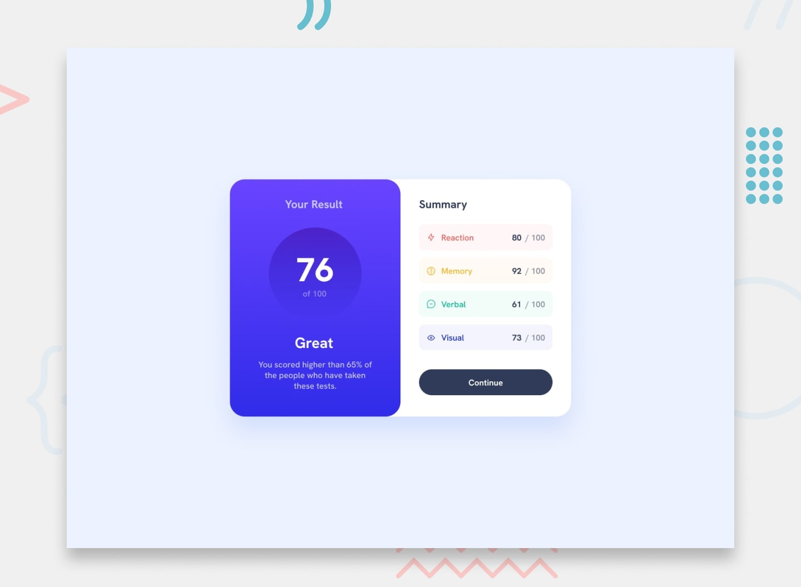

# Results Summary

A responsive results summary component built with HTML, CSS, and vanilla JavaScript. It displays an overall score alongside category-by-category results.




## Features

- Responsive layout for mobile and desktop screens
- Four color-coded result categories with matching icons
- Overall score calculated as the average of the category scores
- Locally hosted Hanken Grotesk font files
- Semantic page sections and decorative icons hidden from assistive technology

## Getting started

No build tools or dependencies are required.

1. Clone or download this repository.
2. Open `index.html` in a browser.

For a local development server, you can also run:

```sh
python3 -m http.server 8000
```

Then visit [http://localhost:8000](http://localhost:8000).

## Project structure

```text
.
├── assets/
│   ├── fonts/       # Hanken Grotesk font files
│   └── images/      # Category icons and favicon
├── design/          # Reference designs and Results Summary screenshot
├── data.json        # Sample results data
├── index.html       # Component markup and result rendering
├── style.css        # Layout, colors, and responsive styles
└── preview.jpg      # Project preview
```

The category scores are currently defined in the script in `index.html`. The overall score is calculated from those values.

## Built with

- HTML
- CSS, including media queries for responsive layouts
- Vanilla JavaScript
- Hanken Grotesk

## Design reference

This project is based on the [Results summary component challenge](https://www.frontendmentor.io/challenges/results-summary-component-CE_K6s0maV) from Frontend Mentor. Reference designs are available in the [`design/`](./design/) folder.
